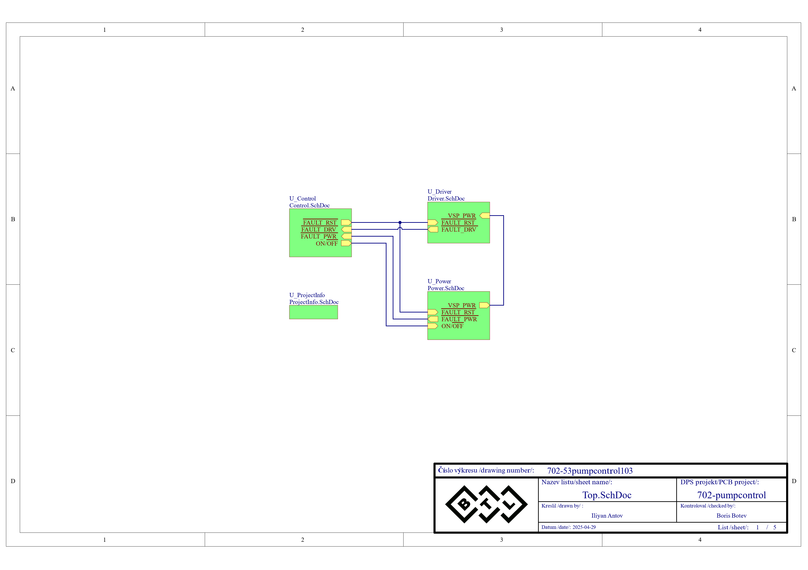
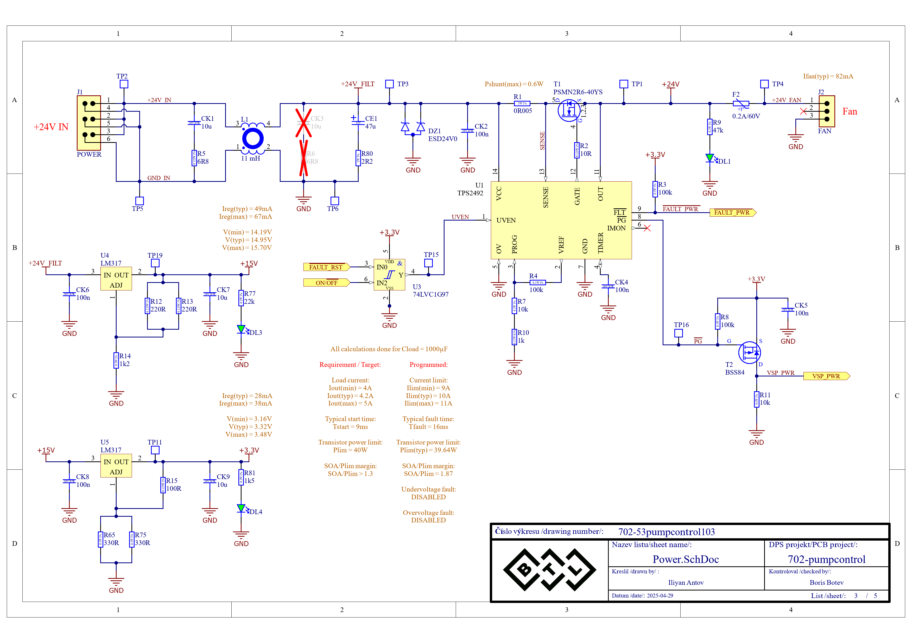
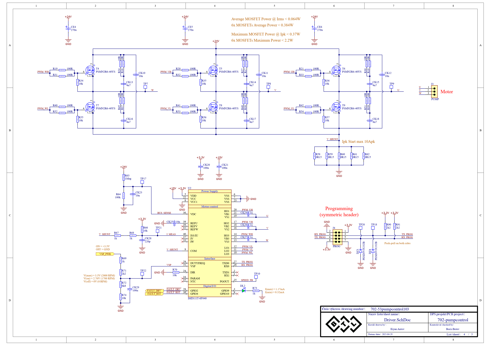
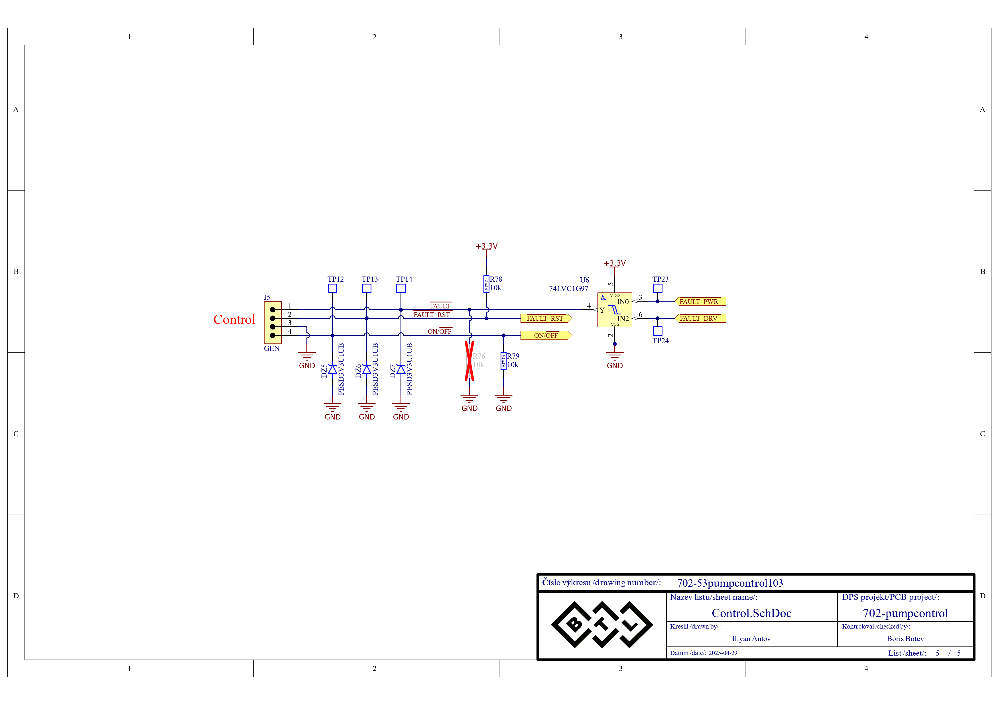
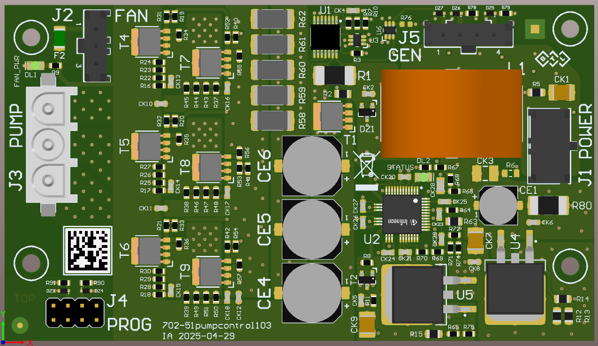

 <h1 align="center"> Система за управление на безчетков мотор за вакуумна помпа  
 Code-free BLDC pump motor driver
 </h1>

## [Документация](./Documentation/DR_Iliyan_Antov_101324019.pdf)

## [Презентация на проекта](./Documentation/Presentation/BLDC%20motor%20driver.pptx)

## Блокова схема:

  

## Принципна електрическа схема:

  
  
  
  

## Печатна платка:

  

## Реализация:
<ul>
  <li><a href="./Design/Testing/702-pumpcontrol102_Test_Report.pdf"> Test report </a></li>
  <li><a href="./Documentation/Images/Measurements/EMC/VER_therapy%20-%20pumpcontrol103.pdf"> EMC report </a></li>
</ul>

## Използвани технологии:
* Schematics/Layout: Altium
* Simulations: LTSpice
* BLDC driver platform: Infineon iMOTION

## Автор:
Илиян Антов - [Iliyan Antov](https://github.com/IliyanAntov) - [i.antov2@gmail.com](i.antov2@gmail.com)
